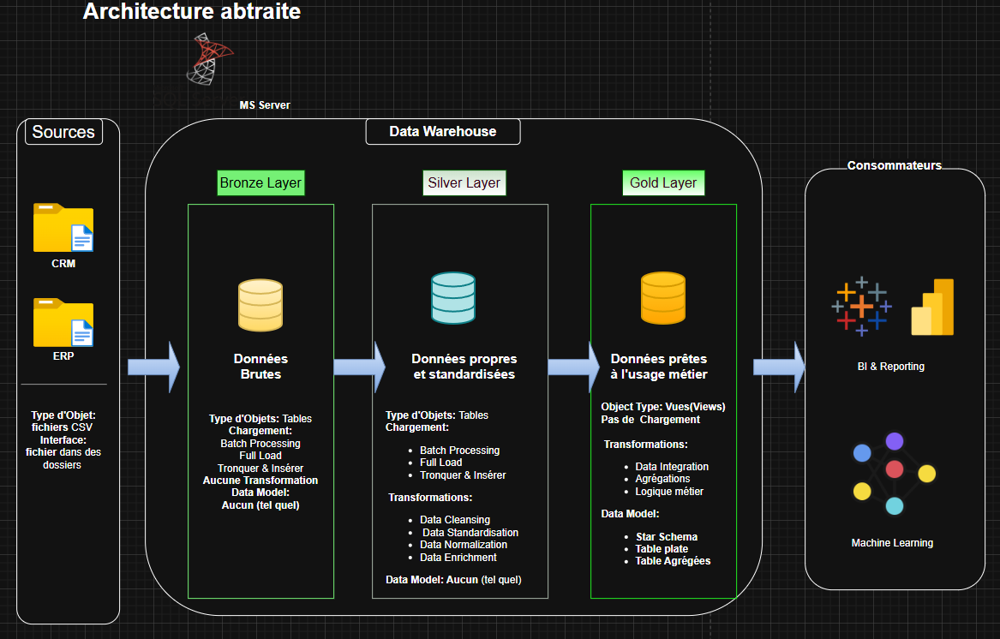

# Projet Data Warehouse
Ce projet vise à procéder à la création d'un moderne data warehouse avec SQL Server, en incluant un processus ETL, du data modeling et de l'analyse de données.

---
## 🏗️ Data Architecture
L’architecture des données pour ce projet suit l’architecture Medallion avec les couches **Bronze**, **Silver** et **Gold** :

1. **Couche Bronze** : Stocke les données brutes telles quelles, issues des systèmes sources. Les données sont ingérées à partir de fichiers CSV dans une base de données SQL Server.  
2. **Couche Silver** : Cette couche inclut les processus de nettoyage, de standardisation et de normalisation des données afin de les préparer à l’analyse.  
3. **Couche Gold** : Contient les données prêtes à l’usage métier, modélisées selon un schéma en étoile, nécessaires pour le reporting et l’analyse.

---

## 📖 Aperçu du projet

Ce projet comprend :

1. **Architecture des données** : Conception d’un entrepôt de données moderne en utilisant l’architecture Medallion avec les couches **Bronze**, **Silver** et **Gold**.  
2. **Pipelines ETL** : Extraction, transformation et chargement des données depuis les systèmes sources vers l’entrepôt.  
3. **Modélisation des données** : Développement de tables de faits et de dimensions optimisées pour les requêtes analytiques.  
4. **Analytique et reporting** : Création de rapports SQL et de tableaux de bord pour générer des insights exploitables.

---

## 🚀 Exigences du Projet

### Construction du Data Warehouse (Ingénierie des Données)

#### Objectif
Développer un data warehouse moderne en utilisant SQL Server pour consolider les données de ventes, afin de permettre des rapports analytiques et une prise de décision éclairée.

#### Spécifications
- **Sources de données** : Importer des données depuis deux systèmes sources (ERP et CRM) fournis sous forme de fichiers CSV.
- **Qualité des données** : Nettoyer et résoudre les problèmes de qualité des données avant l’analyse.
- **Intégration** : Combiner les deux sources dans un modèle de données unique et convivial, conçu pour les requêtes analytiques.
- **Périmètre d'Action** : Se concentrer uniquement sur le jeu de données le plus récent ; l’historisation des données n’est pas requise.
- **Documentation** : Fournir une documentation claire du modèle de données afin de soutenir à la fois les parties prenantes métiers et les équipes d’analyse.

